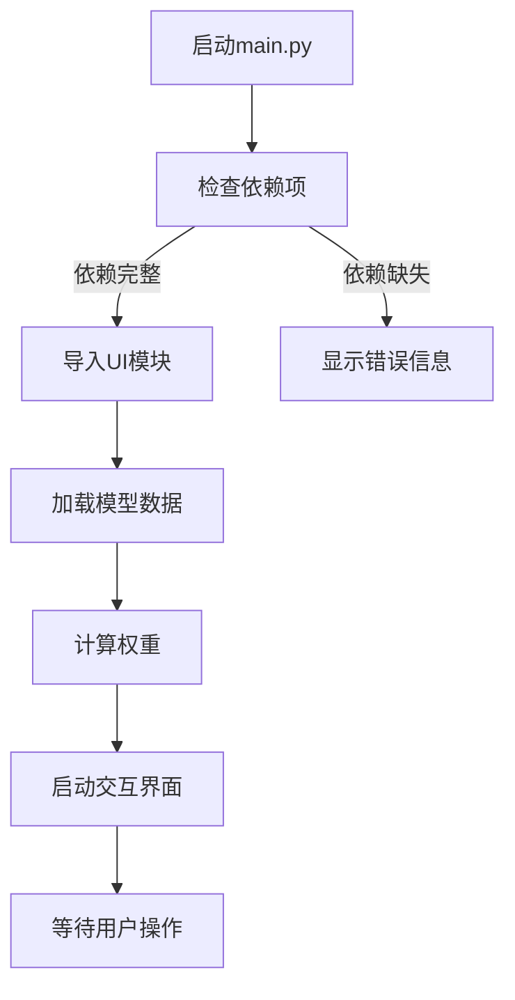
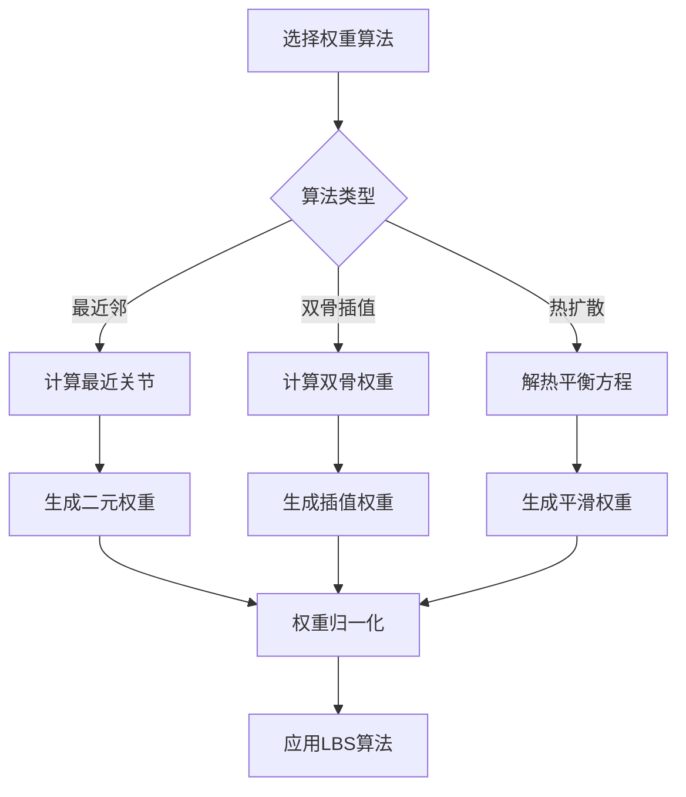
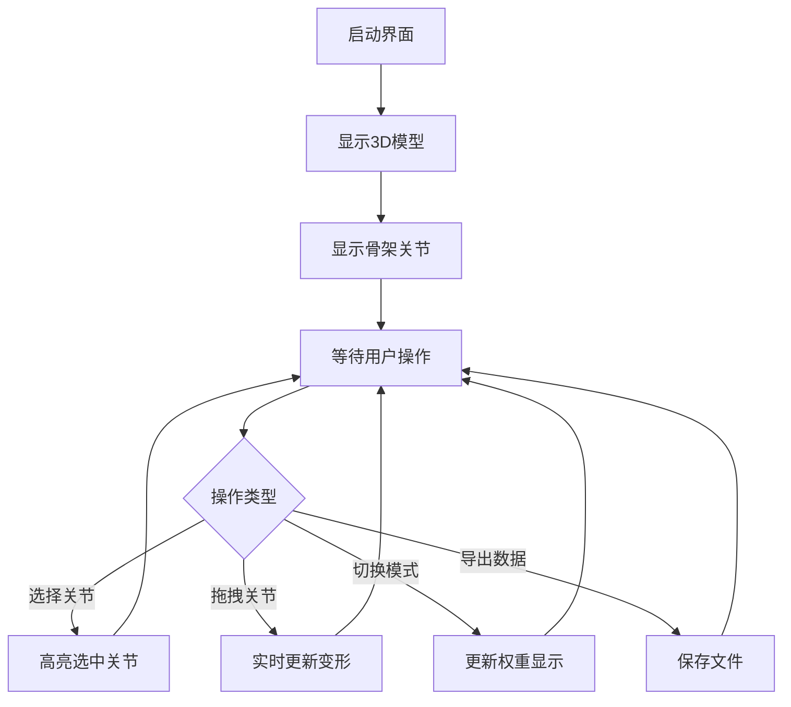

# 计算机动画骨架绑定系统 - 结题文档

清华大学软件学院 软件23班 查益

2022012107 chay22@mails.tsinghua.edu.cn

2025年12月31日

## 项目概述

本项目实现了完整的骨架绑定系统，支持从三维模型加载、骨架创建、权重计算到动画渲染的完整工作流程。系统采用线性混合蒙皮（LBS）算法，实现了实时交互式骨架驱动变形。

## 1. 程序运行环境与依赖

### 1.1 运行环境
- **操作系统**：Windows 10/11, macOS, Linux
- **Python版本**：3.7或更高版本
- **内存要求**：至少4GB RAM
- **显卡要求**：支持OpenGL 3.3或更高版本

### 1.2 编程环境依赖

#### 核心依赖库
| 库名称 | 版本 | 功能说明 |
|--------|------|----------|
| PyQt5 | 5.15+ | GUI框架和事件处理 |
| PyVista | 0.40+ | 3D可视化和交互 |
| NumPy | 1.19+ | 数值计算和矩阵运算 |
| SciPy | 1.7+ | 稀疏矩阵计算和热扩散算法 |
| Trimesh | 3.9+ | 3D网格处理 |
| VTK | 9.0+ | 底层3D渲染引擎 |

#### 安装方法
```bash
cd submit_final/src
pip install -r requirements.txt
```

#### 依赖文件内容（requirements.txt）
```
PyQt5>=5.15.0
pyvista>=0.40.0
numpy>=1.19.0
scipy>=1.7.0
trimesh>=3.9.0
vtk>=9.0.0
```

## 2. 程序模块逻辑关系

### 2.1 系统架构图

```
┌─────────────────┐    ┌─────────────────┐    ┌─────────────────┐
│   数据输入层     │    │   核心算法层     │    │   用户界面层     │
│                 │    │                 │    │                 │
│ ┌─────────────┐ │    │ ┌─────────────┐ │    │ ┌─────────────┐ │
│ │ mesh_io.py  │ │───▶│ │ skeleton.py │ │───▶│ │ui_simple.py │ │
│ │ 模型加载     │ │    │ │ 骨架管理     │ │    │ │ 交互界面     │ │
│ └─────────────┘ │    │ └─────────────┘ │    │ └─────────────┘ │
│                 │    │                 │    │                 │
│ ┌─────────────┐ │    │ ┌─────────────┐ │    │                 │
│ │skeleton_    │ │───▶│ │  lbs.py     │ │    │                 │
│ │ loader.py   │ │    │ │ LBS算法      │ │    │                 │
│ │ 骨架加载     │ │    │ └─────────────┘ │    │                 │
│ └─────────────┘ │    │                 │    │                 │
│                 │    │ ┌─────────────┐ │    │                 │
│                 │    │ │weights_*.py │ │    │                 │
│                 │    │ │ 权重计算     │ │    │                 │
│                 │    │ └─────────────┘ │    │                 │
└─────────────────┘    └─────────────────┘    └─────────────────┘
```

### 2.2 模块详细说明

#### 2.2.1 数据输入层
- **mesh_io.py**：负责加载和处理3D模型网格数据
  - 支持格式：OBJ、FBX、GLB/GLTF
  - 提供网格顶点和面片数据访问接口
  - 处理模型缩放和单位转换

- **skeleton_loader.py**：骨架加载器
  - 从GLB/GLTF文件加载骨架和网格数据
  - 处理关节层次关系和初始变换
  - 支持自定义骨架创建

#### 2.2.2 核心算法层
- **skeleton.py**：骨架数据结构
  - 定义关节层次结构和变换矩阵
  - 实现前向运动学(FK)计算
  - 管理关节的绑定姿势和当前姿势

- **lbs.py**：线性混合蒙皮算法
  - 实现标准的线性混合蒙皮算法
  - 支持多种权重模式的实时切换
  - 提供高效的顶点变形计算

- **weights_heat.py**：热扩散权重算法
  - 基于热平衡方程的权重计算
  - 使用cotangent Laplacian算子
  - 提供平滑的权重过渡效果

- **weights_nearest.py**：最近邻权重算法
  - 每个顶点只绑定到最近的关节
  - 简单快速，适合预览和调试
  - 权重为0或1的二元绑定

#### 2.2.3 用户界面层
- **ui_simple.py**：基于PyQt5的3D交互界面
  - 实时3D模型显示和骨架可视化
  - 支持关节选择和拖拽操作
  - 提供权重模式切换和数据导出功能

## 3. 程序运行流程

### 3.1 启动流程


### 3.2 权重计算流程


### 3.3 交互操作流程


## 4. 功能演示方法

### 4.1 基本功能演示

#### 4.1.1 启动程序
1. **Windows用户**：双击`submit_final/bin/run.bat`
2. **所有平台**：
   ```bash
   cd submit_final/src
   python main.py
   ```

#### 4.1.2 模型加载
- 程序启动后自动加载`data/cow/`目录下的模型
- 支持GLB、FBX、OBJ格式文件
- 自动创建骨架层次结构

#### 4.1.3 权重计算
- **最近邻权重**：点击"简化权重"按钮
- **热扩散权重**：点击"完整权重"按钮
- 实时观察模型变形效果

#### 4.1.4 交互控制
1. **选择关节**：点击红色球体选择骨架关节
2. **拖拽控制**：黄色箭头沿轴移动关节
3. **观察变形**：实时查看模型变形效果
4. **重置状态**：点击"重置"按钮恢复初始状态

### 4.2 高级功能演示

#### 4.2.1 数据导出
- **骨架信息**：导出关节位置、层次关系、变换矩阵
- **权重信息**：导出顶点权重数据
- **完整项目**：保存当前运行状态的完整快照

#### 4.2.2 骨架编辑
- 支持自定义骨架创建
- 通过Blender创建复杂骨架
- 支持模型缩放和位置调整

### 4.3 动画制作
- 通过拖拽关节创建关键帧
- 支持连续动画播放
- 可导出动画视频（需额外录制工具）

## 5. 算法实现细节

### 5.1 权重计算算法

#### 5.1.1 最近邻算法
```python
# 算法思想：每个顶点绑定到最近的关节
for each vertex v:
    min_distance = infinity
    closest_bone = None
    for each bone b:
        distance = distance_to_bone(v, b)
        if distance < min_distance:
            min_distance = distance
            closest_bone = b
    weight[v][closest_bone] = 1.0
```

#### 5.1.2 热扩散算法
基于Pinocchio方法，使用热平衡方程：
```
Lw = 0
```
其中L是cotangent Laplacian算子，通过求解稀疏线性方程组获得平滑权重。

### 5.2 线性混合蒙皮算法
```python
# LBS公式：v' = Σ(w_i * T_i * v)
for each vertex v:
    transformed_v = zero_vector
    for each bone i:
        T = G_current[i] * G_bind_inv[i]
        transformed_v += w[i] * (T * v)
    output_v = transformed_v
```

## 6. 系统特色与创新

### 6.1 技术特色
- **完整工作流**：从模型加载到动画输出的完整解决方案
- **多种算法**：支持三种不同复杂度的权重计算算法
- **实时交互**：基于PyVista的3D实时可视化
- **跨平台**：支持Windows、macOS、Linux三大平台

### 6.2 用户体验
- **简洁界面**：直观的3D操作界面
- **即时反馈**：实时显示变形效果
- **数据导出**：支持多种格式的数据保存
- **一键运行**：Windows用户可直接双击运行

## 7. 性能优化

### 7.1 算法优化
- **稀疏矩阵**：使用SciPy稀疏矩阵存储权重
- **向量化计算**：NumPy向量化操作提高计算效率
- **GPU加速**：支持GPU加速的矩阵运算（可选）

### 7.2 内存管理
- **延迟加载**：按需加载模型数据
- **缓存机制**：缓存计算结果避免重复计算
- **内存池**：重用大数组减少内存分配

## 8. 问题与解决方案

### 8.1 常见问题
- **模型显示异常**：检查模型文件格式和路径
- **权重计算错误**：验证骨架层次结构和关节位置
- **性能问题**：优化权重计算算法和渲染设置

### 8.2 调试方法
- **日志输出**：程序运行时的详细日志信息
- **可视化调试**：3D界面实时显示计算结果
- **数据验证**：导出中间数据进行验证

## 9. 扩展功能

### 9.1 未来扩展方向
- **动画编辑器**：支持关键帧动画编辑
- **多模型支持**：同时处理多个模型
- **物理模拟**：增加软体物理效果
- **GPU加速**：CUDA加速的权重计算

## 10. 参考文献与引用

### 10.1 核心算法参考文献
- **Pinocchio方法**：
  Baran, I., & Popović, J. (2007). Automatic rigging and animation of 3d characters. ACM Transactions on Graphics (TOG), 26(3), 72-es.

- **Laplacian算子**：
  https://en.wikipedia.org/wiki/Discrete_Laplace_operator

- **线性混合蒙皮**：
  Lewis, J. P., Cordner, M., & Fong, N. (2000). Pose space deformation: a unified approach to shape interpolation and skeleton-driven deformation. Proceedings of the 27th annual conference on Computer graphics and interactive techniques.

### 10.2 开源项目引用
- **Trimesh库**：3D网格处理和数据结构
- **PyVista库**：3D可视化和交互框架
- **SciPy库**：稀疏矩阵计算和线性方程组求解

### 10.3 模型数据来源
- **测试模型**：项目内置的cow模型
- **格式支持**：基于GLTF/GLB标准格式
- **骨架创建**：支持Blender导出的骨架数据
